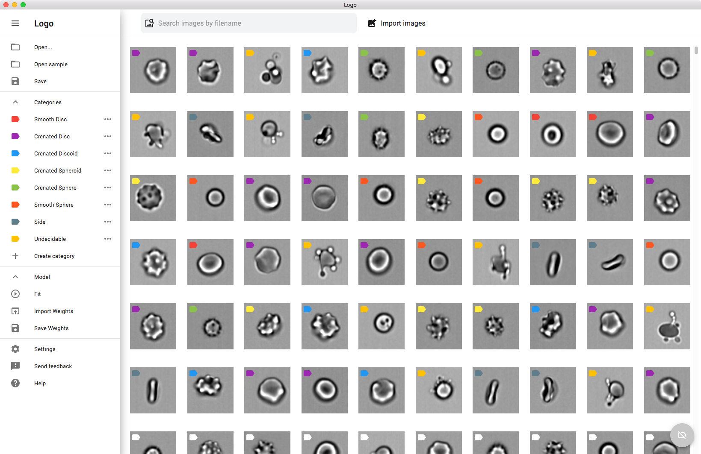

[](https://travis-ci.org/cytoai/cyto)

# CYTO AI

A web-based deep learning tool for classification of human cells, created with Tensorflow.js and React.
https://application.cyto.ai/


      

## Getting Started

These instructions will get you a copy of the project up and running on your local machine for development and testing purposes. See deployment for notes on how to deploy the project on a live system.

### Prerequisites

What things you need to install the software and how to install them

1. Install npm and Node.js: https://www.npmjs.com/get-npm


### Installing

1. Clone the project: ``` git clone https://github.com/cytoai/cyto.git ```

2. Move into the created directory: ``` cd cyto  ```

3. Install all dependencies: ``` npm install ```

4. Run on local server: ``` npm start ```


## Deployment

You can deploy by running: ``` npm deploy ```

You can define where to deploy in the package.json file under: ** homepage **

## Contributing

Please read [CONTRIBUTING.md](https://github.com/cytoai/cyto/blob/master/CONTRIBUTING.md) for details on our code of conduct, and the process for submitting pull requests to us.

## Versioning

We use [SemVer](http://semver.org/) for versioning.

## License

This project is licensed under the MIT License - see the [LICENSE.md](LICENSE.md) file for details

## Acknowledgments

* Hat tip to anyone whose code was used
* Inspiration
* etc
